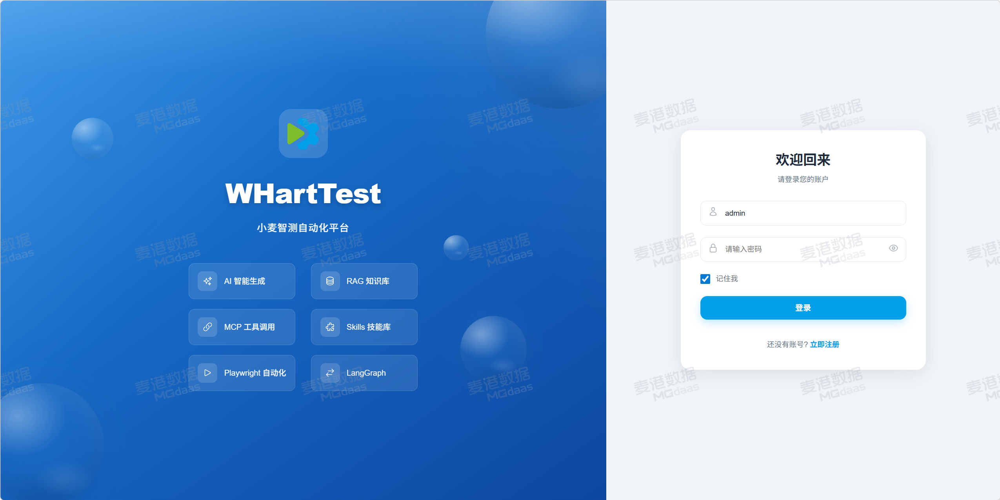
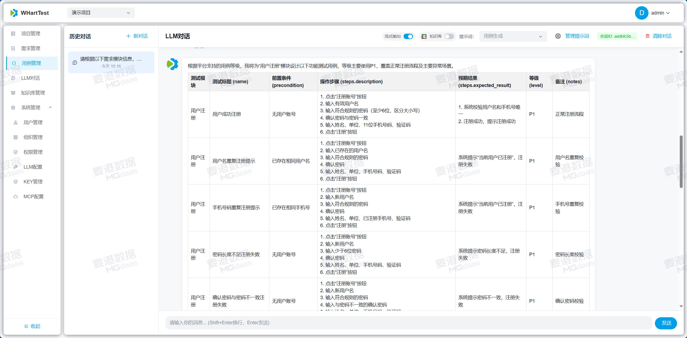
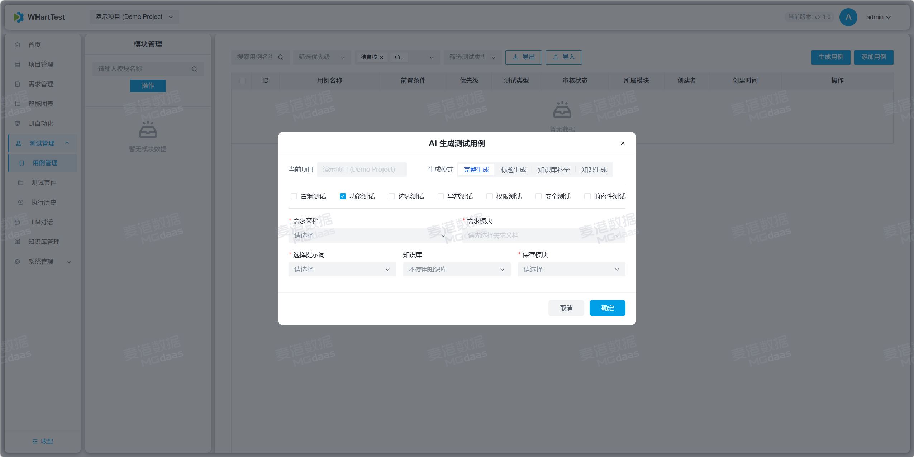
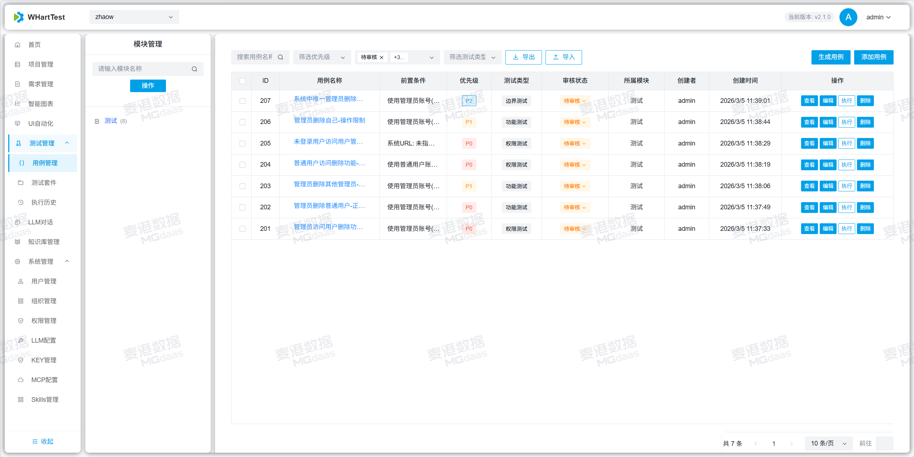
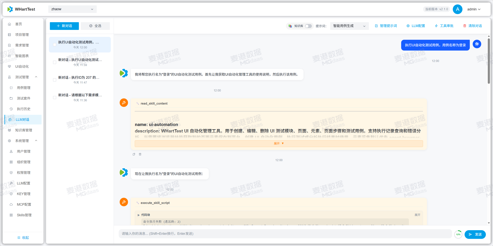
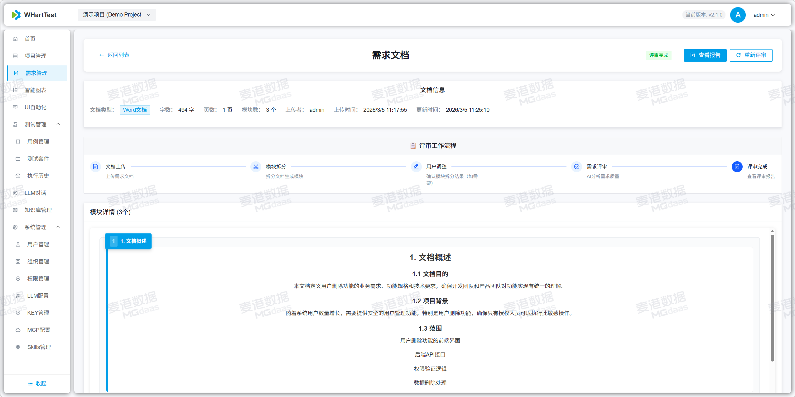

# WHartTest - AI驱动的智能测试用例生成平台

## 项目简介

WHartTest 是一个基于 Django REST Framework 构建的AI驱动测试自动化平台，核心功能是通过AI智能生成测试用例。平台集成了 LangChain、MCP（Model Context Protocol）工具调用、项目管理、需求评审、测试用例管理以及先进的知识库管理和文档理解功能。利用大语言模型和多种嵌入服务（OpenAI、Azure OpenAI、Ollama等）的能力，自动化生成高质量的测试用例，并结合知识库提供更精准的测试辅助，为测试团队提供一个完整的智能测试管理解决方案。


## 文档
详细文档请访问：https://mgdaaslab.github.io/WHartTest/

## 快速开始

### Docker 部署（推荐 - 开箱即用）

```bash
# 1. 克隆仓库
git clone https://github.com/MGdaasLab/WHartTest.git
cd WHartTest

# 2. 准备配置（使用默认配置，包含自动生成的API Key）
cp .env.example .env

# 3. 一键启动（直接运行脚本，按提示选择 1 或 2）
./run_compose.sh

# 4. 访问系统
# http://localhost:8913 (admin/admin123456)
```

**就这么简单！** 系统会自动创建默认API Key，MCP服务开箱即用。

### 统一部署脚本

如果你使用仓库自带脚本部署，现在启动后会先让你在“远程拉镜像”和“本地构建镜像”之间二选一：

```bash
./run_compose.sh
```

这个脚本现在会：

- 先选择部署方式：`remote` 远程镜像下载，或 `local` 本地构建镜像
- `remote` 模式会自动在内置远程镜像仓库候选里测速择优，用户只需选择 `1` 即可
- `remote` 会按仓库类型分别选择：Docker Hub 使用官方 / `docker.1panel.live` / `docker.1ms.run` / `docker.xuanyuan.me` / `docker.m.daocloud.io`，GHCR 使用官方 / `ghcr.1ms.run` / `ghcr.nju.edu.cn` / `ghcr.m.daocloud.io`，MCR 使用官方 / `mcr.azure.cn` / `mcr.m.daocloud.io`
- `local` 模式会自动探测当前网络下更快的 `APT / PyPI / npm / Hugging Face` 下载地址
- Python 依赖安装现在支持自动回退：首选测速最快的 PyPI 源，某个包下载超时会顺序切到其余候选继续安装
- `local` 内置候选包含官方源、清华、中科大、阿里云、腾讯云、华为云、北外、上海交大、`npmmirror`、`hf-mirror` 等
- 支持通过环境变量继续追加你自己的候选镜像源
- 本地构建默认使用 Docker 缓存，不再每次都 `--no-cache`

常用示例：

```bash
# 交互选择部署方式
./run_compose.sh

# 直接使用远程预构建镜像
./run_compose.sh remote

# 直接使用本地构建，并自动选择更快下载源
./run_compose.sh local

# 本地构建时强制使用原生官方源
DOCKER_SOURCE_PROFILE=native ./run_compose.sh local

# 本地构建时强制只在镜像源里择优
DOCKER_SOURCE_PROFILE=mirror ./run_compose.sh local

# 给 PyPI 追加自定义候选源（注意用引号包起来）
DOCKER_PIP_CANDIDATES_EXTRA="corp|https://pypi.example.com/simple|https://pypi.example.com/simple/pip/" ./run_compose.sh local

# 只有在本地全量重建时才禁用缓存
DOCKER_BUILD_NO_CACHE=1 ./run_compose.sh local
```

> ⚠️ **生产环境提示**：请登录后台删除默认API Key并创建新的安全密钥。详见 [快速启动指南](./docs/QUICK_START.md)

详细的部署说明请参考：
- [快速启动指南](./docs/QUICK_START.md) - **推荐新用户阅读**
- [GitHub 自动构建部署指南](./docs/github-docker-deployment.md)
- [完整部署文档](https://mgdaaslab.github.io/WHartTest/)

## 页面展示

| | |
  |---|---|
  |  |  |
  | |  |
  |  |  |
  |  |  |
  |  |  |
  |  |  |
  |  |  |
  |  |  |
  | 
## 贡献指南

1. Fork 项目
2. 创建功能分支
3. 提交更改
4. 创建 Pull Request


## 联系方式

如有问题或建议，请通过以下方式联系：
- 提交 Issue
- 项目讨论区


---

**WHartTest** - AI驱动测试用例生成，让测试更智能，让开发更高效！
